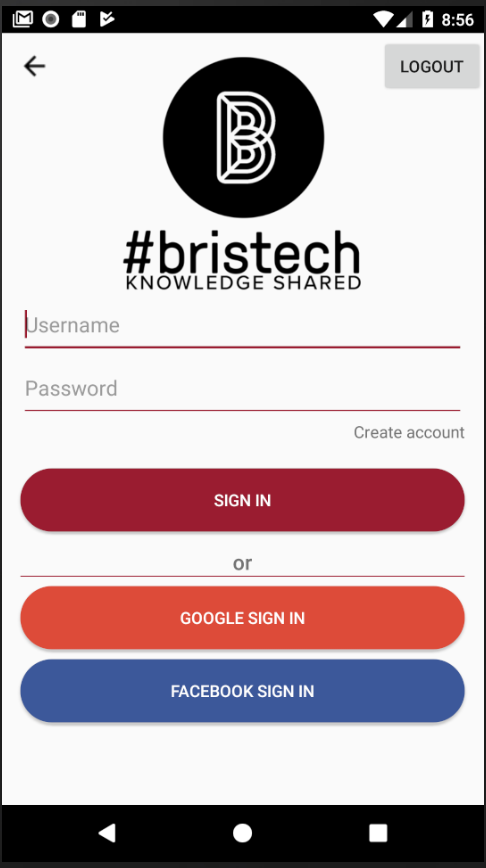
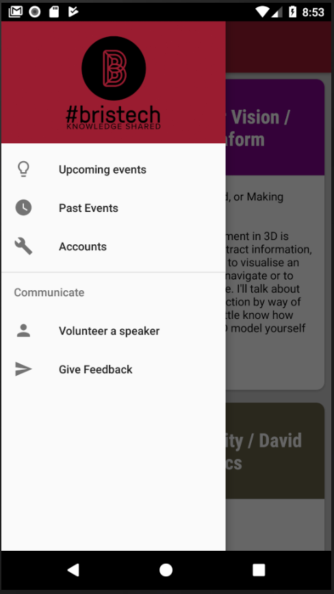
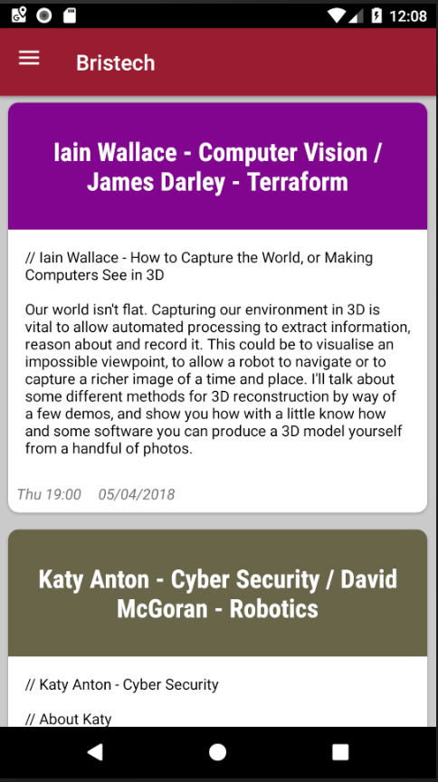
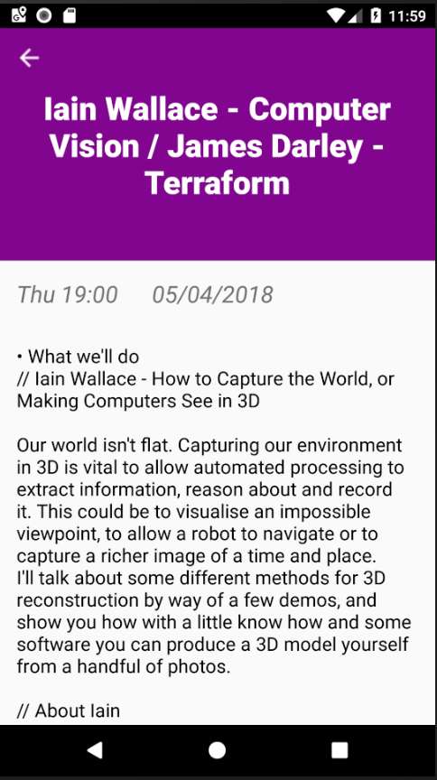

# Bristech
  
  

## Aim
The aim of the project is to develop a more elegant way for speakers, managers and attendees to interact in the run-up to and during events. The key motivation for the new platform is to go beyond what meetup currently offers Bristech and its users.

## Solution
Our solution is a dynamic mobile application partially integrated with meetup.com, to begin the transition to a holistic application while not losing the benefits of meetup.com. Members of the event will be able to view past and upcoming events, register for events, provide feedback on events, and be prompted to provide feedback when attending a talk, as well as monitoring their attendance through a geofencing check-in system to ensure they are in the vicinity of the venue at the correct time.

This is one part of a two part solution which in this case takes the form of an **Android app_**.  
It's build with *Android studio* with **JAVA**, **Groovy** and **XML**.

## Screenshots
      

## Pre-requisites
- Android studio v3.0+
- Android SDK 23+
- Gradle 4.4
- Java 7

## Build Instructions
1. Clone the repository *git clone https://github.com/TheWalkingFridge/Bristech-App*
2. Install [Java](https://java.com/en/download/help/download_options.xml)
3. Install [Android Studio](http://developer.android.com/sdk/index.html) with Android SDK Tools
4. Install an emulator in Android Studio with *Google Play Services* or use a physical Android phone
5. Build the project and run it

## Features
- Tracking attendance with Geofences
- Notification allerts for attending events prompting for feedback
- Display upcoming and past events for Bristech
- Register/Deregister for events
- Leave Feedback for the event
- Integration with *Bristech-server* for events and user login
- Single Sign On with *Google* and *Facebook*
- Sign-in/Sign-up with email
- Standard Material Design layouts and elevations
- Made use of Android support library
- Recycler views, Coordinator views, Drawer view
- Error handling with Toasts and Snackbars
- HTTP Requests and Handling

## License
Copyright 2017 Bristech

Licensed under the Apache License, Version 2.0 (the "License");
you may not use this file except in compliance with the License.
You may obtain a copy of the License at

    http://www.apache.org/licenses/LICENSE-2.0

Unless required by applicable law or agreed to in writing, software
distributed under the License is distributed on an "AS IS" BASIS,
WITHOUT WARRANTIES OR CONDITIONS OF ANY KIND, either express or implied.
See the License for the specific language governing permissions and
limitations under the License.
